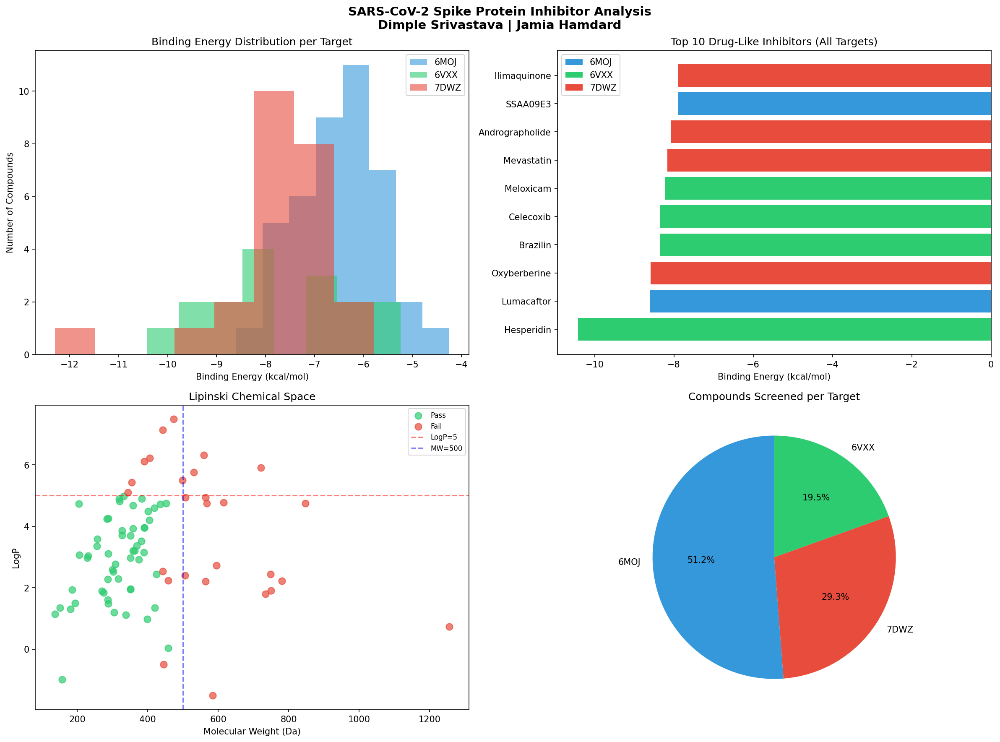
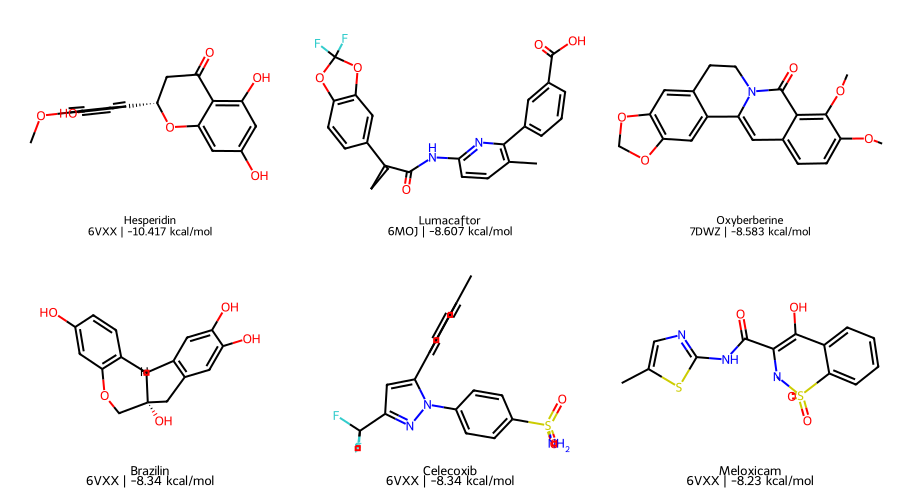

# 🧬 SARS-CoV-2 Spike Protein Inhibitor Screening

**Dimple Srivastava | MSc Biotechnology**  
**Jamia Hamdard, Department of Virology, New Delhi | June 2026**

---

## 📌 Project Overview

A complete **virtual screening and molecular docking pipeline** for identifying potential SARS-CoV-2 spike protein inhibitors. 85 bioactive and drug compounds were screened against three SARS-CoV-2 spike protein targets using AutoDock Vina, followed by RDKit-based post-docking analysis, Lipinski drug-likeness filtering, ADMET profiling, PCA, and heatmap visualization.

---

## 🎯 Objectives

- Prepare SARS-CoV-2 protein structures for docking analysis
- Prepare and optimize 85 ligand structures for virtual screening
- Perform molecular docking simulations using AutoDock Vina
- Analyze binding affinities and identify promising drug-like compounds
- Perform ADMET profiling of top candidates
- Multivariate analysis using PCA and hierarchical clustering heatmap

---

## 🧪 Target Proteins

| PDB ID | Description |
|--------|-------------|
| **6M0J** | Spike RBD — Receptor Binding Domain (42 compounds) |
| **6VXX** | Whole Spike Glycoprotein (16 compounds) |
| **7DWZ** | S2 Fusion Domain (25 compounds) |

---

## 🛠️ Tools and Software

| Tool | Purpose |
|------|---------|
| AutoDock Vina | Molecular docking simulations |
| PyMOL | Protein–ligand visualization |
| Open Babel | File format conversion and energy minimization |
| Ubuntu Linux | Docking environment |
| Bash Scripting | Automated batch docking workflows |
| Python + RDKit | Post-docking analysis and visualization |
| Pandas / Matplotlib | Data analysis and charting |
| ADMETlab 3.0 | ADMET property prediction |
| ClustVis | PCA and heatmap visualization |

---

## 📁 Repository Structure

```
sars-cov2-spike-inhibitor-screening/
│
├── sars_cov2_inhibitor_analysis.ipynb   ← RDKit analysis notebook
├── results.csv                           ← Docking scores (85 compounds)
├── full_analysis.csv                     ← Compounds + molecular properties
├── top_drug_like_hits.csv                ← Top Lipinski-filtered candidates
├── clustvis_pca_input.csv                ← PCA input data
├── clustvis_pca_with_groups.csv          ← PCA input with protein groups
├── sars_cov2_analysis.png                ← RDKit analysis charts
├── top_inhibitors.png                    ← 2D structures of top compounds
├── clustvisPCA.pdf                       ← PCA plot (colored by protein)
├── clustvisHeatmap.pdf                   ← Hierarchical clustering heatmap
├── ADMET_Analysis_Table.pdf              ← Full ADMET analysis table
└── README.md
```

---

## ⚙️ Methodology

### Part 1 — Molecular Docking (Ubuntu + AutoDock Vina)

#### 1. Protein Preparation
- Retrieved protein structures from RCSB Protein Data Bank (PDB)
- Removed water molecules and unwanted ligands
- Added polar hydrogens and Gasteiger charges
- Converted to PDBQT format for AutoDock Vina

#### 2. Ligand Preparation
- Collected 85 compound SDF files from PubChem
- Format conversion: SDF → PDB → PDBQT using Open Babel
- Energy minimization using MMFF94 force field

#### 3. Molecular Docking
- Grid box defined around active site for each protein
- Exhaustiveness set to 8 for reliable results
- Batch docking of all 85 compounds per protein target
- Results extracted as binding affinity (kcal/mol)

#### 4. Visualization
- Docked complexes visualized in PyMOL
- Hydrogen bond interactions identified
- Binding pose analysis for top candidates

### Part 2 — Post-Docking Analysis (Python + RDKit)

- Loaded docking results from results.csv
- Matched compounds to SDF structure files
- Calculated molecular properties: MW, LogP, HBD, HBA, TPSA
- Applied Lipinski Rule of 5 drug-likeness filter
- Identified top hits per protein target
- Generated visualizations and saved results

### Part 3 — ADMET Analysis (ADMETlab 3.0)

- Predicted absorption, distribution, metabolism, excretion and toxicity
- Evaluated GI absorption, BBB permeability, P-gp substrate activity
- Assessed CYP enzyme inhibition profile (CYP1A2, 2C19, 2C9, 2D6, 3A4)
- Toxicity screening: AMES, hERG blockade, hepatotoxicity, carcinogenicity

### Part 4 — Multivariate Analysis (ClustVis)

- PCA performed on 82 compounds using 8 physicochemical parameters
- Hierarchical clustering heatmap for pattern identification
- Compounds colored by protein target for group analysis

---

## 💻 Key Commands Used

### Ligand Preparation

```bash
# Convert SDF to PDB
for f in *.sdf; do
    obabel "$f" -O "${f%.sdf}.pdb" --gen3d --addh
done

# Energy minimization
for f in *.pdb; do
    obabel "$f" -O "${f%.pdb}_min.pdb" --minimize --ff MMFF94
done

# Convert to PDBQT
for f in *_min.pdb; do
    obabel "$f" -O "${f%.pdb}.pdbqt"
done
```

### Molecular Docking

```bash
# Target 1: 6M0J — Spike RBD
for f in *.pdbqt; do
  vina --receptor ../6moj.pdbqt \
       --ligand "$f" \
       --center_x -47.011 --center_y -28.575 --center_z 2.208 \
       --size_x 25 --size_y 25 --size_z 25 \
       --exhaustiveness 8 \
       --out "${f%.pdbqt}_out.pdbqt"
done

# Target 2: 6VXX — Whole Spike
for f in *.pdbqt; do
  if [[ "$f" != *_out.pdbqt ]]; then
    vina --receptor ../6vxx.pdbqt \
         --ligand "$f" \
         --center_x 210 --center_y 210 --center_z 189 \
         --size_x 30 --size_y 30 --size_z 30 \
         --exhaustiveness 8 \
         --out "${f%.pdbqt}_out.pdbqt"
  fi
done

# Target 3: 7DWZ — S2 Fusion Domain
for f in *.pdbqt; do
  if [[ "$f" != *_out.pdbqt ]]; then
    vina --receptor ../7dwz.pdbqt \
         --ligand "$f" \
         --center_x 151.746 --center_y 153.256 --center_z 164.642 \
         --size_x 30 --size_y 30 --size_z 30 \
         --exhaustiveness 8 \
         --out "${f%.pdbqt}_out.pdbqt"
  fi
done
```

### Extract Binding Energies

```bash
for f in *_out.pdbqt; do
    energy=$(grep "REMARK VINA RESULT" "$f" | head -n 1 | awk '{print $4}')
    echo "$(basename "$f" _out.pdbqt),$energy"
done > results.csv
```

---

## 📊 Results

### Docking Results



### Top Drug-Like Inhibitors Per Target

| Protein | Top Compound | Binding Energy | MW | LogP |
|---------|-------------|----------------|-----|------|
| **6M0J** | Lumacaftor | -8.60 kcal/mol | 452.41 | 4.75 |
| **6VXX** | Hesperidin | -10.41 kcal/mol | 302.28 | 2.52 |
| **7DWZ** | Oxyberberine | -8.58 kcal/mol | 351.36 | 2.97 |

### Top 2D Structures



---

## 💊 ADMET Analysis

ADMET properties of the top 10 compounds predicted using **ADMETlab 3.0**.

| Compound | Target | Docking Score | GI Absorption | BBB | AMES | hERG | Hepatotoxicity |
|----------|--------|--------------|---------------|-----|------|------|----------------|
| Hesperidin | 6VXX | -10.41 | Low | No | High | Low | Moderate |
| Lumacaftor | 6M0J | -8.60 | High | No | Low | Moderate | Low |
| Oxyberberine | 7DWZ | -8.58 | High | Yes | High | Moderate | High |
| Mevastatin | 7DWZ | -8.16 | High | Yes | Moderate | Low | Moderate |
| Celecoxib | 6VXX | -8.34 | High | No | Low | Moderate | High |
| Meloxicam | 6VXX | -8.23 | High | No | Low | Low | Moderate |
| Andrographolide | 7DWZ | -8.06 | High | No | Moderate | Low | High |
| Indomethacin | 6VXX | -7.84 | High | Yes | Low | Low | High |
| SSAA09E3 | 6M0J | -7.89 | High | Yes | High | High | High |
| Brazilin | 6VXX | -8.34 | High | No | Low | Low | High |

### Lead Candidate Highlights
- **Lumacaftor** — High GI absorption, low AMES toxicity, low hERG risk, best 6M0J binder
- **Meloxicam** — Lowest AMES (0.05) and hERG (0.005) among all candidates
- **Andrographolide** — No CYP enzyme inhibition across all 5 enzymes

📄 Full ADMET table: [ADMET_Analysis_Table.pdf](ADMET_Analysis_Table.pdf)

---

## 📈 Multivariate Analysis

### PCA — Principal Component Analysis

PCA was performed on 82 compounds using 8 physicochemical parameters.
PC1 and PC2 explain **45.3%** and **20.3%** of total variance (**65.6% cumulative**).
Compounds are colored by protein target: 6M0J (red), 6VXX (blue), 7DWZ (green).

📄 PCA Plot: [clustvisPCA.pdf](clustvisPCA.pdf)

**Key observations:**
- All 3 protein groups overlap — compounds share similar physicochemical space
- 6M0J compounds show widest chemical diversity
- 7DWZ compounds cluster more tightly — similar drug-like properties
- Outlier compounds on far left represent high molecular weight structures

### Heatmap — Hierarchical Clustering

Hierarchical clustering heatmap showing relationship between compounds
and their physicochemical properties across all 3 protein targets.

📄 Heatmap: [clustvisHeatmap.pdf](clustvisHeatmap.pdf)

**Key observations:**
- Compounds cluster into distinct groups based on molecular properties
- Flavonoids and polyphenols (Hesperidin, Catechin gallate, EGCG) cluster together
- Statins (Mevastatin, Lovastatin, Simvastatin) form a tight cluster
- High MW antibiotics (Azithromycin, Erythromycin, Clarithromycin) separate clearly

---

## 🔑 Key Achievements

- Automated docking of 85 ligands using AutoDock Vina batch processing
- Screened against three SARS-CoV-2 spike protein targets (6M0J, 6VXX, 7DWZ)
- Built complete end-to-end virtual screening pipeline
- Post-docking RDKit analysis with Lipinski Rule of 5 filtering
- ADMET profiling of top 10 lead candidates
- PCA and hierarchical clustering for multivariate compound analysis
- Identified Hesperidin (-10.41 kcal/mol) as strongest binder at 6VXX target

---

## 💡 Skills Demonstrated

`Molecular Docking` `Structure-Based Drug Design` `Virtual Screening`
`Bioinformatics` `Linux Command Line` `Bash Scripting`
`Python` `RDKit` `ADMET Analysis` `PCA` `Hierarchical Clustering`
`Scientific Data Analysis` `Protein–Ligand Interaction Analysis`
`AutoDock Vina` `PyMOL` `Open Babel` `ADMETlab` `ClustVis`

---

## 👩‍🔬 Author

**Dimple Srivastava**  
MSc Biotechnology | J.C. Bose University (YMCA), Faridabad  
Dissertation Research | Jamia Hamdard, Department of Virology, New Delhi

[](https://www.linkedin.com/in/dimple-srivastava-1a15142b7)
[](https://github.com/dimple-srivastava-bio-24)

